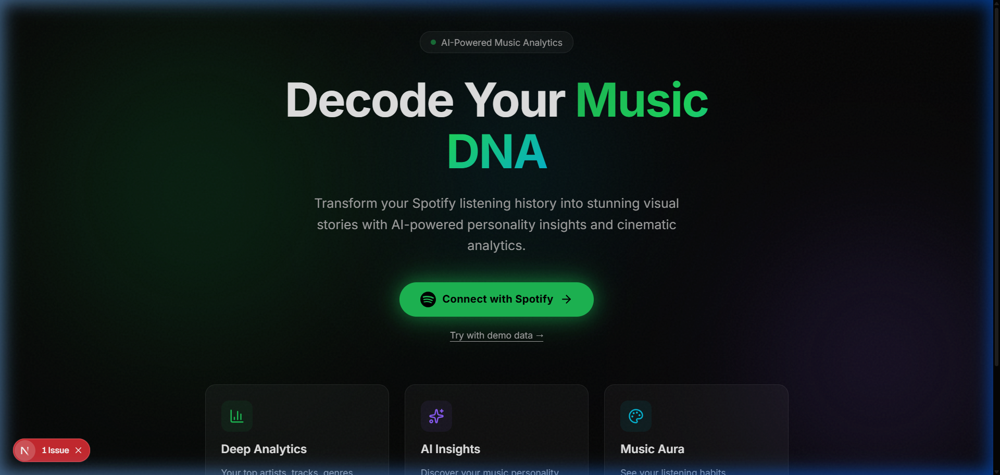
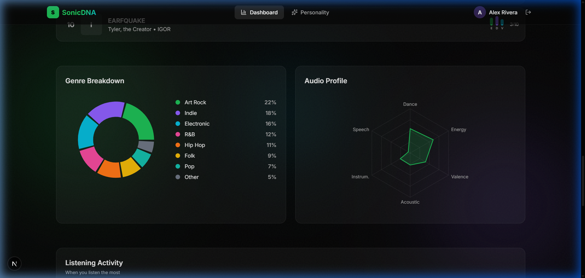
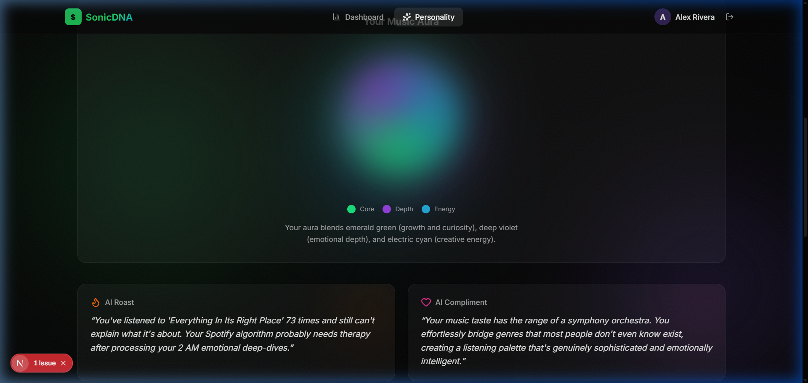
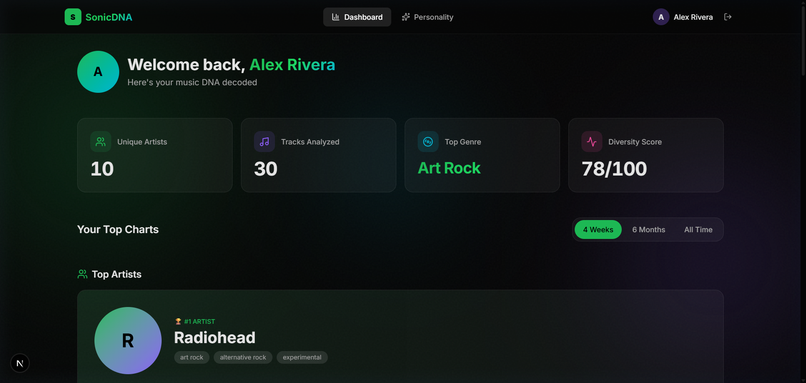
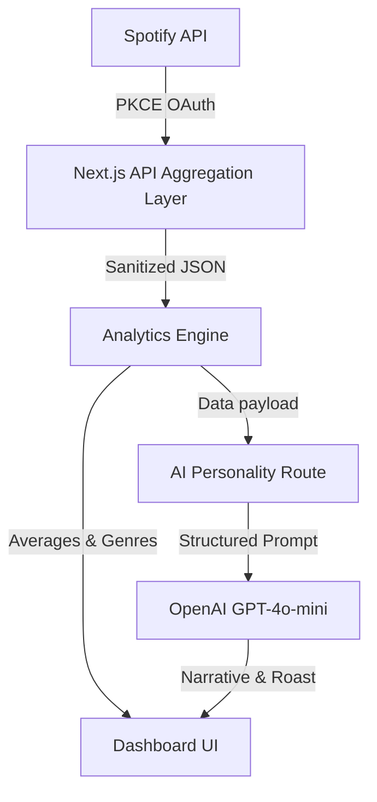

<div align="center">
  
  
  # SonicDNA
  ### Decode Your Music DNA
  
  **AI-powered Spotify analytics platform with cinematic visual storytelling.**

  
  
  
  
</div>

---

## 🔗 Live Demo
https://sonicdna.vercel.app/

---

## 📸 Screenshots

*A cinematic experience from end to end.*

<div align="center">
  
  
</div>
<br/>
<div align="center">
  
  
</div>
<br/>
<div align="center">
  
  
</div>

---

## ✨ Features

- **Spotify OAuth Authentication**: Secure PKCE flow using Next.js 15 route handlers.
- **AI Music Personality Analysis**: Generates roasts and compliments using OpenAI `gpt-4o-mini`.
- **Cinematic Music Aura Visualization**: Custom animated gradients based on your unique audio features.
- **Listening Heatmaps**: GitHub-style activity grid of your weekly listening times.
- **Genre Analytics**: Interactive Recharts donut charts and audio radar mapping.
- **Wrapped-style Share Cards**: Exportable, social-media ready summary cards.
- **Real Spotify Listening Insights**: Live data pulling top tracks, artists, and audio features.
- **Premium Responsive UI**: Beautifully designed for both desktop and mobile.

---

## 📖 Design Philosophy

SonicDNA was designed to transform raw Spotify statistics into emotional visual storytelling.

Instead of overwhelming users with data tables, the platform creates a cinematic and immersive experience inspired by Spotify Wrapped, Apple Music, and modern AI interfaces. It leverages glassmorphism, depth lighting, layered typography, and highly intentional micro-interactions to make the user feel like their music data is a premium product of its own.

---

## 🏗️ Architecture



---

## 🤖 AI-Assisted Development

AI tools were used for:
- architecture planning
- UI refinement
- animation systems
- OAuth debugging
- analytics logic
- premium design polish

*Full planning and development logs are available in the `/ai-logs` folder.*

---

## 🚀 Local Setup

1. **Clone the repository**
   ```bash
   git clone https://github.com/yourusername/sonicdna.git
   cd sonicdna
   ```

2. **Install dependencies**
   ```bash
   npm install
   ```

3. **Configure Environment Variables**
   Rename `.env.example` to `.env.local` and add your credentials:
   ```env
   SPOTIFY_CLIENT_ID=your_client_id
   SPOTIFY_CLIENT_SECRET=your_client_secret
   OPENAI_API_KEY=your_openai_key
   NEXT_PUBLIC_BASE_URL=http://127.0.0.1:3000
   ```

4. **Run the development server**
   ```bash
   npm run dev
   ```

5. **Open the app**
   Visit `http://127.0.0.1:3000` in your browser.

---

## ⚠️ Known Limitations

- Spotify API rate limits may affect heavy usage.
- Some analytics rely on Spotify’s available listening history, which has historical limits.
- Playback controls are intentionally excluded to ensure full compatibility with free Spotify accounts.

---

## 🧠 Reflection: Our Learnings

Building SonicDNA over the course of this hackathon was an incredible exercise in balancing technical constraints with high-end product design. Because we wanted to create a platform that felt less like a "dashboard" and more like an "experience," we learned several key lessons:

**1. The Complexity of Modern OAuth**
To meet Spotify's security standards, we had to abandon implicit grant flows and implement a full **PKCE (Proof Key for Code Exchange)** OAuth flow using Next.js 15 Route Handlers. Managing `code_verifier` state across HTTP-only cookies securely taught us a lot about modern web authentication and session lifecycle management.

**2. API Defensive Programming**
Spotify's API can rate-limit aggressively when fetching multiple endpoints (Artists, Tracks, Features) simultaneously. We learned how to build highly resilient fetch pipelines (`safeFetch`) that gracefully degrade rather than crash. We even built an entire parallel **Mock Data System** so that if the Spotify API fails during judging, the UI seamlessly falls back to realistic demo data.

**3. Taming AI for Deterministic Outputs**
Using OpenAI's `gpt-4o-mini` to generate the "Music Personality" taught us that AI is best used when fed highly structured, pre-computed analytics. Instead of sending raw JSON to the LLM, we aggregated the data into human-readable traits (e.g., "Diversity Score: 78", "Top Genre: Indie Rock") which resulted in much more accurate, witty, and personalized AI responses without hallucinations.

**4. CSS Performance & The Cinematic Aesthetic**
Achieving the "Apple/Linear" aesthetic requires heavy use of blurs (`backdrop-filter`) and animated mesh gradients. We learned that layering multiple blurred divs can destroy render performance. By moving the gradients to fixed background layers, utilizing CSS masks (`mask-image: radial-gradient`), and ensuring `will-change: transform` was used sparingly, we maintained 60fps scrolling while keeping the UI looking expensive and atmospheric.
